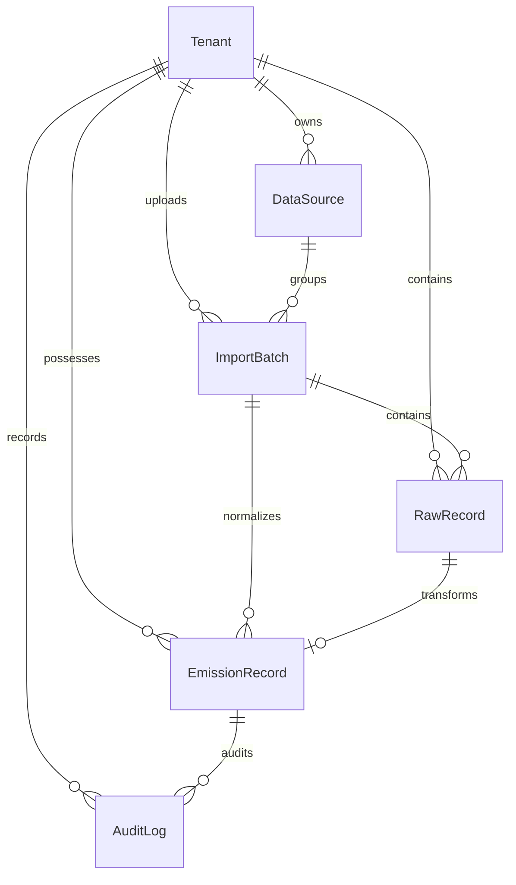

# ESG Ingestion Data Model

This document outlines the data model designed for the Breathe ESG Ingestion Platform. The design focuses on **data lineage**, **auditability**, and **multi-tenancy**, balancing prototype simplicity with production readiness.

---

## Model Reference

### 1. Tenant
The root anchor for multi-tenancy. Every piece of operational or raw data belongs to a tenant, ensuring logical database partitioning.
- **Fields**:
  - `company_name` (CharField): Name of the organization.
  - `industry` (CharField): Voluntary industry tag.
  - `country` (CharField): Primary operating country.
  - `created_at` (DateTimeField): Timestamp of creation.

### 2. DataSource
Represents a configured data feed for a tenant.
- **Fields**:
  - `tenant` (ForeignKey → Tenant): Parent tenant.
  - `source_type` (CharField): `SAP` | `UTILITY` | `TRAVEL`.
  - `ingestion_mode` (CharField): `CSV_UPLOAD` | `API_STUB` | `MANUAL`.
  - `description` (TextField): Internal analyst notes.
  - `created_at` (DateTimeField): Integration timestamp.

### 3. ImportBatch
Tracks each execution of data ingestion (e.g., a file upload).
- **Fields**:
  - `tenant` (ForeignKey → Tenant): Parent tenant.
  - `data_source` (ForeignKey → DataSource): Ingestion source.
  - `original_filename` (CharField): Name of the file uploaded.
  - `uploaded_at` (DateTimeField): Upload timestamp.
  - `status` (CharField): `PROCESSING` | `COMPLETED` | `COMPLETED_WITH_ERRORS` | `FAILED`.
  - `total_rows` (IntegerField): Rows detected.
  - `accepted_rows` (IntegerField): Rows normalized.
  - `failed_rows` (IntegerField): Rows containing fatal parse errors.

### 4. RawRecord
An immutable store of ingested data. Preserves the exact CSV input as JSON, enabling full reproducibility of normalization logic.
- **Fields**:
  - `tenant` (ForeignKey → Tenant): Parent tenant.
  - `import_batch` (ForeignKey → ImportBatch): Associated batch.
  - `row_number` (IntegerField): Row index in the source file.
  - `raw_json` (JSONField): Raw CSV key-value dictionary.
  - `parse_status` (CharField): `RAW` | `NORMALIZED` | `FAILED`.
  - `error_message` (TextField): Error logs if normalization fails.

### 5. EmissionRecord
The normalized, structured activity record used for emissions accounting and analytics.
- **Fields**:
  - **Lineage**: Links to `Tenant`, `ImportBatch`, and `RawRecord` (1-to-1).
  - **Source context**: `source_type` (SAP/Utility/Travel), `source_record_id` (SAP document #, meter ID, trip ID).
  - **Activity Info**: `activity_type`, `category`, `period_start`, `period_end`.
  - **Metrics**:
    - `quantity_original`, `unit_original`: Ingested value.
    - `quantity_normalized`, `unit_normalized`: Normalized value (L, KG, M3, KWH, KM, NIGHTS).
  - **Emissions**: `estimated_emissions_kgco2e`, `emission_factor_source`.
  - **Quality & Review**:
    - `confidence` (CharField): `HIGH` | `MEDIUM` | `LOW`.
    - `flags` (JSONField): List of suspicious indicators (e.g., `["zero_quantity", "date_parse_failure"]`).
    - `review_status` (CharField): `NEEDS_REVIEW` | `APPROVED` | `REJECTED` | `FLAGGED` | `LOCKED`.
    - `analyst_notes` (TextField): Notes added during review.

### 6. AuditLog
An immutable ledger tracking every analyst action, modification, and workflow transition.
- **Fields**:
  - `tenant` (ForeignKey → Tenant): Parent tenant.
  - `emission_record` (ForeignKey → EmissionRecord): Target record.
  - `action` (CharField): `CREATED` | `APPROVED` | `REJECTED` | `FLAGGED` | `EDITED` | `LOCKED`.
  - `before_json` (JSONField): Snapshot of the record *before* the action.
  - `after_json` (JSONField): Snapshot of the record *after* the action.
  - `actor` (CharField): Operator username or system.
  - `timestamp` (DateTimeField): Modification timestamp.
  - `note` (TextField): Reason for edit/action.

---

## Design Decisions

### Why RawRecord is Immutable
In a real enterprise setting, data ingestion pipelines change. A bug in a normalizer might miscalculate emissions. By keeping the immutable `RawRecord` JSON, we can re-run normalization without asking the client to re-upload files.

### Soft Workflow Transitions
Records aren't immediately blocked. When a normalizer detects a minor issue (e.g., missing plant code), it assigns a `FLAGGED` status and `LOW` confidence but still inserts the record. This allows analysts to resolve anomalies manually instead of rejecting the entire batch.

### Lock Step
Once an analyst clicks **Lock for Audit**, the record is marked `LOCKED` and cannot be edited, approved, or rejected again. This guarantees that exported ESG reports match the archived database state exactly.
